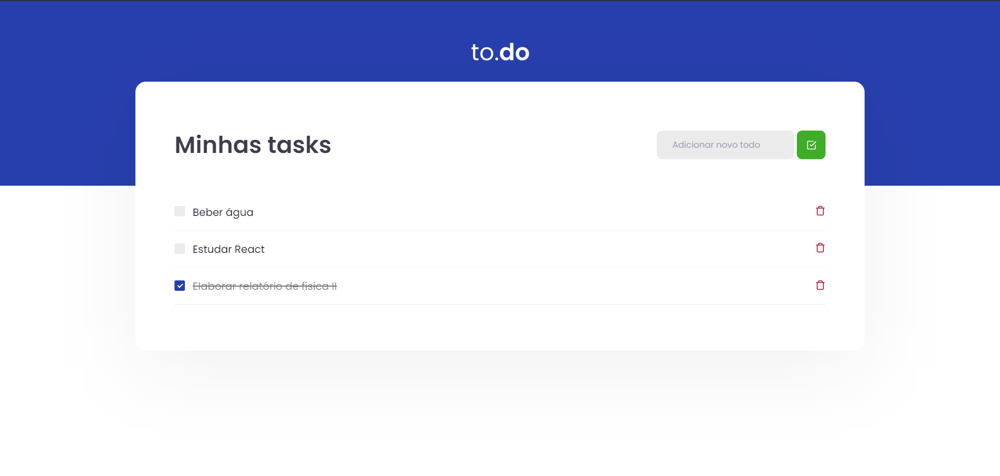

<h1 align="center"> Conceitos do react aplicado a Tasks <h1>

<h2>Sobre</h2>

 

Nesse desafio, foi criado uma aplicação para treinar o que foi aprendido até agora no ReactJS. 
Essa é uma aplicação onde o principal objetivo é uma pequena aplicação de atividades a fazer, para treinar um pouco mais sobre manipulação do estado no React.

<h2>Utilizando a aplicação </h2>

- Clonando a aplicação

<code> git clone https://github.com/LuzianeFreitas/conceitos-do-react.git </code>

- Executando

<code> yarn dev </code>

- Acessando a aplicação

<code> http://localhost:8080/ </code>
